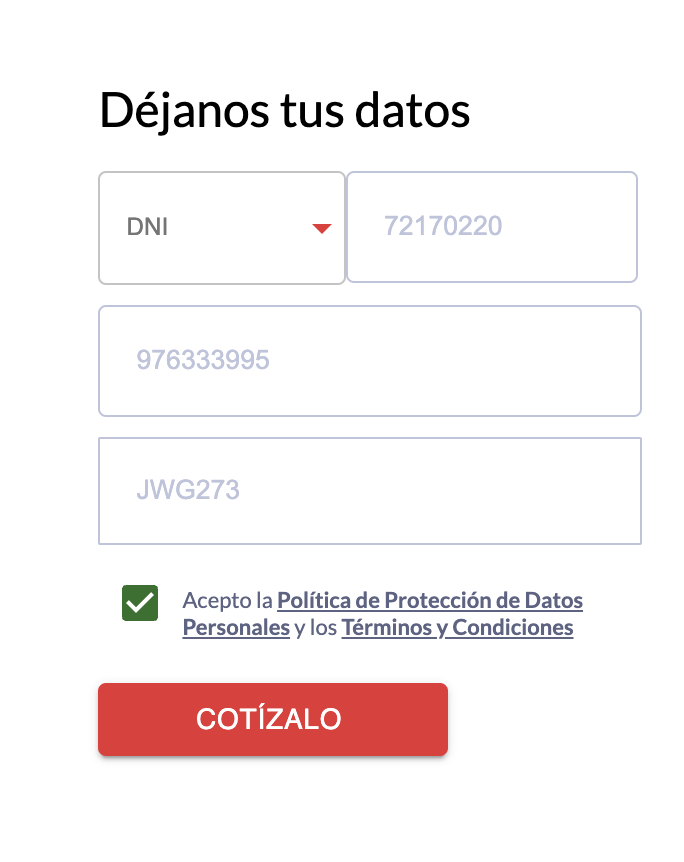

# RIMAC CHALLENGE

Este proyecto es una aplicación web construida con React y TypeScript, utilizando una arquitectura basada en características (feature-based structure). A continuación se describe el propósito de las librerías utilizadas y la estructura del proyecto.

[Visita la aplicación desplegada en Amplify](https://main.d18fnk4rz2zoyg.amplifyapp.com/)

Puedes poner cualquier dato en el formulario (ya tiene validaciones según el campo) y el sistema consumirá el servicio de jsonplaceholder user 1 

Ejemplo (puede ser cualquier dato):



## Librerías Utilizadas

### Dependencias

- **@emotion/react** y **@emotion/styled**: Utilizadas para la estilización de componentes con CSS-in-JS, ofreciendo una solución flexible y poderosa para el diseño y los estilos en componentes React.

- **@hookform/resolvers**: Proporciona resolutores para la integración de bibliotecas de validación como Yup con React Hook Form, facilitando la validación de formularios.

- **@mui/icons-material** y **@mui/material**: Implementan los componentes de Material UI, una biblioteca de componentes React que sigue las directrices de Material Design, proporcionando una interfaz de usuario consistente y estilizada.

- **axios**: Utilizado para hacer solicitudes HTTP de manera eficiente y sencilla, manejando las respuestas y errores de las solicitudes a la API.

- **react** y **react-dom**: Las bibliotecas fundamentales para construir interfaces de usuario en React. `react` proporciona la base para la creación de componentes, mientras que `react-dom` se encarga de la integración con el DOM.

- **react-hook-form**: Facilita la gestión de formularios en React, proporcionando una API sencilla para la validación y el manejo de datos del formulario.

- **react-number-format**: Permite formatear números de manera flexible en los campos de entrada, ideal para trabajar con datos numéricos como precios o cantidades. Se me hizo más sencillo para delimitar los caracteres permitidos en un input

- **react-router-dom**: Maneja la navegación y el enrutamiento en la aplicación web, permitiendo la creación de rutas y enlaces entre diferentes vistas.

- **sass**: Permite usar Sass para la preprocesación de estilos, proporcionando características avanzadas como variables, anidamiento y mixins.

- **yup**: Utilizado para la validación de datos en combinación con React Hook Form, ofreciendo un esquema de validación robusto y fácil de definir.

- **zustand**: Una librería para el manejo del estado global en React, ofreciendo una solución simple y eficiente para compartir estado entre componentes. Elegí esto porque considero que para pasar y estar en el siguiente flujo donde se muestra los datos del vehículo es necesario tener un gestor de estado que verifique que ya se pasó por el primer flujo, es decir tener datos de vehiculo disponibles en el gestor de estado, para ello implementé un componente verificador de rutas.

### DevDependencies


- **typescript**: Para tener un mejor tipado y control de errores

- **vite**: Un build tool moderno que proporciona una experiencia de desarrollo rápida y eficiente, con soporte integrado para módulos ES y una configuración mínima.

- **yarn**: Gestor de paquetes que se utiliza para manejar las dependencias del proyecto, asegurando la instalación y la gestión eficiente de los paquetes.

## Arquitectura Feature-Based Structure

La aplicación sigue una arquitectura basada en características (feature-based structure). Esta estructura organiza el código en función de las características o funcionalidades de la aplicación, en lugar de por tipo de archivo (componentes, servicios, etc.). 

### Ventajas de la Arquitectura Feature-Based

1. **Escalabilidad**: Facilita la expansión y el mantenimiento del proyecto al agrupar todos los archivos relacionados con una característica específica en un solo lugar.

2. **Mantenimiento**: Mejora la capacidad de mantenimiento del código al hacer que cada característica sea independiente y auto contenida, lo que reduce la complejidad al trabajar en una funcionalidad específica.

3. **Colaboración**: Facilita la colaboración entre equipos al permitir que diferentes desarrolladores trabajen en características separadas sin interferir con otras partes del código.

4. **Modularidad**: Promueve la creación de módulos y componentes reutilizables, lo que hace que el código sea más limpio y organizado.

## Scripts de Construcción

Para levantar el proyecto en local ejecuta los siguientes comandos:

```bash
yarn set version stable
```

```bash
yarn install
```

```bash
yarn dev
```

Para generar el build y levantar en local

```bash
yarn build
```

```bash
serve -s dist -l 3000
```